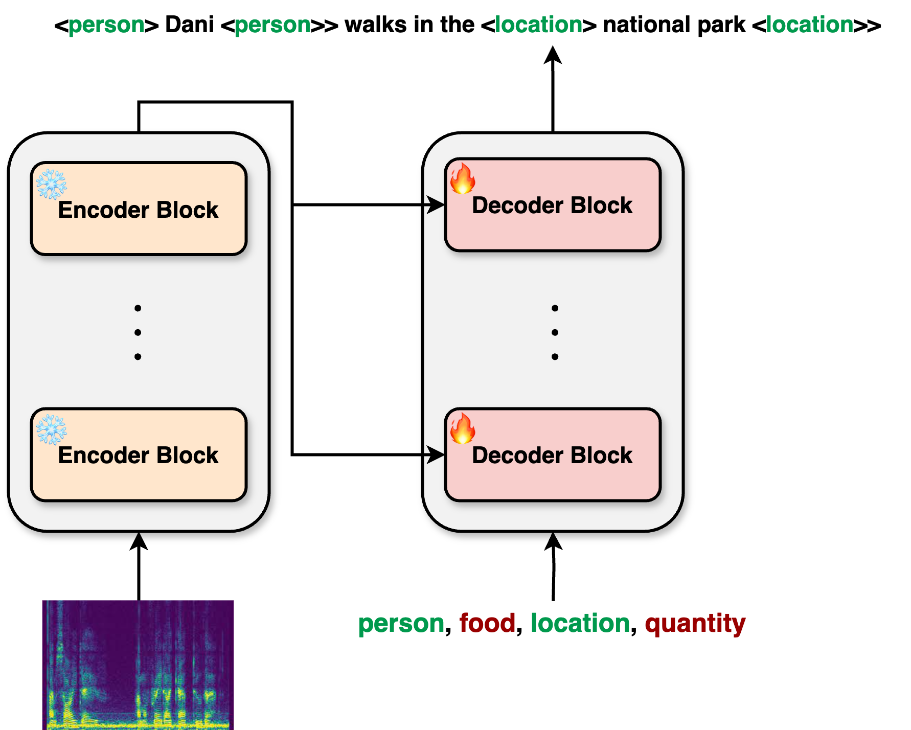

# WhisperNER

Implementation for the paper [_WhisperNER: Unified Open Named Entity and Speech Recognition_](https://arxiv.org/abs/2409.08107).
WhisperNER is a unified model for automatic speech recognition (ASR) and named entity recognition (NER), with zero-shot capabilities.
The WhisperNER model is designed as a strong base model for the downstream task of ASR with NER, and can be fine-tuned on specific datasets for improved performance.

[//]: # (add image from assets, make it smaller)
<p align="center">

</p>


## Links

- 📄 Paper: [WhisperNER: Unified Open Named Entity and Speech Recognition](https://arxiv.org/abs/2409.08107).
- 🤗 Demo: Check out the demo [here](https://huggingface.co/spaces/aiola/whisper-ner-v1).
- 🤗 [WhisperNER model collection](https://huggingface.co/collections/aiola/whisperner-6723f14506f3662cf3a73df2).
- 📊 Datasets:
  - [Voxpopuli-NER-EN](https://huggingface.co/datasets/aiola/Voxpopuli_NER): A dataset for zero-shot NER evaluation based on the [Voxpopuli dataset](https://github.com/facebookresearch/voxpopuli). The VoxPopuli Data is released under [CC0](https://creativecommons.org/share-your-work/public-domain/cc0/) license, with the European Parliament's legal disclaimer. (see European Parliament's [legal notice](https://www.europarl.europa.eu/legal-notice/en/) for the raw data)

## Installation
Start with creating a virtual environment and activating it:

```bash
conda create -n whisper-ner python=3.10 -y
conda activate whisper-ner
pip install torch==2.2.2 torchaudio==2.2.2 --index-url https://download.pytorch.org/whl/cu118
```

Then install the package:
```bash
git clone https://github.com/aiola-lab/whisper-ner.git
cd whisper-ner
pip install -e .
```

--------

## Dataset

The dataset should have the following json format, with keys `text`, `audio`, and `ner`:

```json
[
  {
    "text": "The cost of HIV, TB and HCV medicines for treatment and for prevention varies from one country to another.",
    "audio": "test_part_0/20170703-0900-PLENARY-18-en_20170703-19:41:40_6.wav",
    "ner": [
      [
        12,
        15,
        "Disease",
        "HIV",
        "A virus that attacks the immune system and can lead to AIDS if not treated."
      ],
      [
        17,
        19,
        "Disease",
        "TB",
        "Tuberculosis, a bacterial infection that primarily affects the lungs but can also affect other parts of the body."
      ],
      [
        24,
        27,
        "Disease",
        "HCV",
        "Hepatitis C virus, a viral infection that causes liver inflammation, sometimes leading to serious liver damage."
      ],
      [
        28,
        37,
        "Healthcare Product",
        "medicines",
        "Substances used to treat or prevent disease and improve health."
      ],
      ...
    ]
  },
  ...
]
```

An example of a dataset can be found in [Voxpopuli-NER-EN](https://huggingface.co/datasets/aiola/Voxpopuli_NER).

## ## Training and finetuning

To train the model, run the following command (or modify it according to your needs):

```bash
python whisper_ner/trainer.py \
  --whisper-model-name aiola/whisper-ner-v1 \
  --lr 1e-06 \
  --batch-size 4 \
  --gradient-accumulation-steps 1 \
  --eval-steps 500 \
  --save-steps 500 \
  --max-steps 10000 \
  --fp16 False \
  --use-lora False \
  --lora-merge-and-unload False \
  --max-eval-samples=1000 \
  --entity-dropout-prob=0.1 \
  --n-neg-samples 2 \
  --output-path <output-dir> \
  --parts-to-freeze encoder \
  --predict-with-generate False \
  --audio-root-dir <root-of-audio-file> \
  --test-data-path <test-json-path> \
  --train-data-path <train-json-path> \
  --validation-data-path <val-json-path> \
  --wandb-logging true \
  --exp-name <wandb-exp-name> \
  --wandb-entity <wandb-entity>
```

## Inference
Inference can be done using the following code:

```python
import torch
from transformers import WhisperProcessor, WhisperForConditionalGeneration
from whisper_ner.utils import audio_preprocess, prompt_preprocess

model_path = "aiola/whisper-ner-v1"
audio_file_path = "path/to/audio/file"
prompt = "person, company, location"  # comma separated entity tags
    
# load model and processor from pre-trained
processor = WhisperProcessor.from_pretrained(model_path)
model = WhisperForConditionalGeneration.from_pretrained(model_path)

device = torch.device("cuda" if torch.cuda.is_available() else "cpu")
model = model.to(device)

# load audio file: user is responsible for loading the audio files themselves
input_features = audio_preprocess(audio_file_path, processor)
input_features = input_features.to(device)

prompt_ids = prompt_preprocess(prompt, processor)
prompt_ids = prompt_ids.to(device)

# generate token ids by running model forward sequentially
with torch.no_grad():
    predicted_ids = model.generate(
        input_features,
        prompt_ids=prompt_ids,
        generation_config=model.generation_config,
        language="en",
    )

# post-process token ids to text, remove prompt
transcription = processor.batch_decode(
    predicted_ids, skip_special_tokens=True
)[0]
print(transcription)
```

## Citation

If you find our work or this code to be useful in your own research, please consider citing the following paper:

```bib
@article{ayache2024whisperner,
  title={WhisperNER: Unified Open Named Entity and Speech Recognition},
  author={Ayache, Gil and Pirchi, Menachem and Navon, Aviv and Shamsian, Aviv and Hetz, Gill and Keshet, Joseph},
  journal={arXiv preprint arXiv:2409.08107},
  year={2024}
}
```
